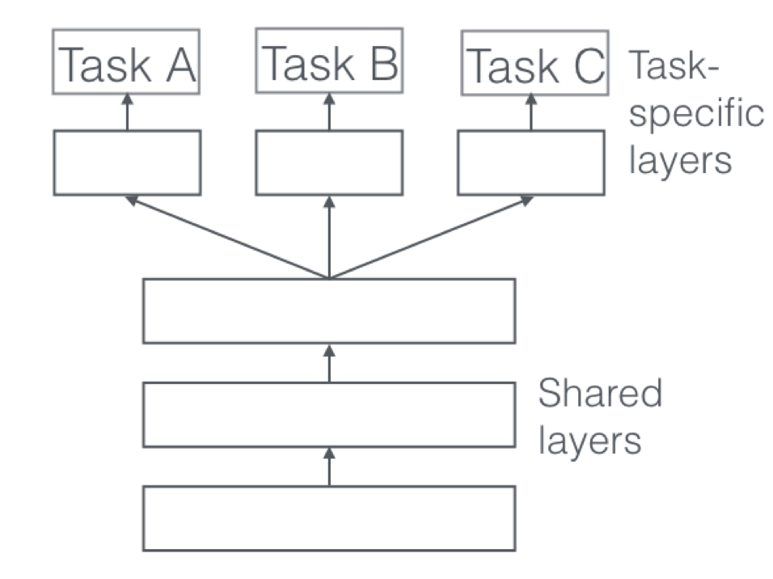
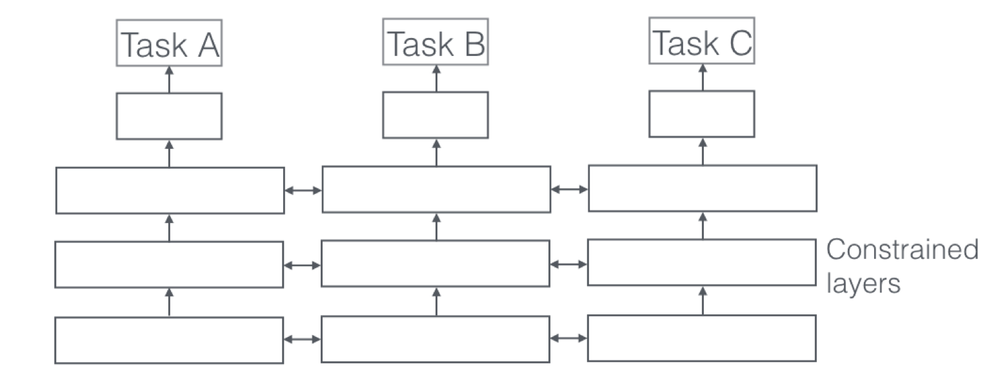

# Thinking about Multi-Task Learning

Thinking about how multi-task learning(MTL) works in NLP. Inspired by [the work from Ruder](https://arxiv.org/pdf/1706.05098.pdf).

The repository aims for thinking about the advantages of MTL in NLP. Why it works and how to choose the helpful auxiliary tasks for the main task. It may be a hard work. However, BERT, a hit model, also give us a reason to explore the rules of language or inference, which defines a neat task for the language model. 

## What is Multi-task learning

"Multitask Learning is an approach to inductive transfer that improves generalization by using the domain information contained in the training signals of related tasks as an inductive bias. It does this by learning tasks in parallel while using a shared representation; what is learned for each task can help other tasks be learned better." said by Rich Caruana, 1997.

## Motivation

1. Inspired by human learning, for learning new tasks, we often apply the knowledge we have acquired by learning related tasks. 
2. We can view multi-task learning as a form of inductive transfer. Inductive transfer can help improve a model by introducing an inductive bias, which generally leads to solutions that generalize better.

## Two MTL methods for Deep Learning
1. Hard Parameter Sharing
    1. get shared representation for different tasks
    2. reduces the risk of overfitting
    3. schematic diagram
    
    

    
   

2. Soft Parameter Sharing
    1. each task has its own model with its own parameters
    2. encourage the parameters to be similar using regulations
    3. schematic diagram
    
    

    
   
